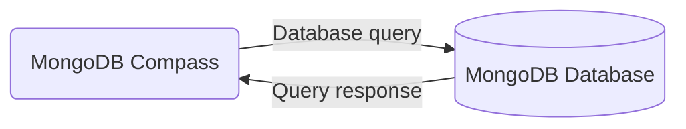

# Introduction to MongoDB database management system

> _"MongoDB is a document database with the scalability and flexibility that you want with the querying and indexing that you need."_

In the second section of the course, we will learn the principles of the MongoDB database management system, which is one of the most widely adopted NoSQL database management systems. During this section, you will learn about the principles of the data model in the MongoDB database management system, how to install the MongoDB database management system and the MongoDB Compass tool, and how to create a database in the MongoDB database management system.

The MongoDB database management system is a widely adopted NoSQL database management system. Based on the [State of Database Survey](https://stateofdb.com/) in 2023, MongoDB was among the three most well-known and widely used database management systems, along with PostgreSQL and MySQL. MongoDB has many use cases, web development being one of them. It is the database technology in the popular [MERN](https://www.mongodb.com/resources/languages/mern-stack) technology stack, which is widely used to develop web applications.

MongoDB is a document-oriented database. Familiarize yourself with document-oriented databases by reading the article [What is a Document Database](https://www.mongodb.com/resources/basics/databases/document-databases) and with the principles of the MongoDB database management system by reading the following articles:

- [MongoDB Basics](https://www.mongodb.com/resources/products/fundamentals/basics)
- [Documents](https://www.mongodb.com/docs/manual/core/document/)
- [Data Modeling](https://www.mongodb.com/docs/manual/data-modeling/)

Once you have read through the articles, test your knowledge by completing the "Introduction to MongoDB database management system" Moodle exam. After passing the exam, move on to the next topic in this section.

> [!IMPORTANT]  
> Exercise 1 👨‍💻: Read the four articles mentioned above. Then, take and pass the "Introduction to MongoDB database management system" multiple-choice Moodle exam related to the principles of the MongoDB database management system. You have 45 minutes to complete the exam, and passing grade requires at least 9/13 points. You can retake the exam two times in case you fail.

## Installing MongoDB on our computer

So that we can start practicing the usage of MongoDB we need to install the database management system for our computer. Download the installation program [here](https://www.mongodb.com/try/download/community). Remember to choose the suitable platform based on your operating system (e.g. Windows or macOS).

## User interfaces for MongoDB

[MongoDB Compass](https://www.mongodb.com/products/tools/compass) is a graphical user interface for operating MongoDB. Other user interfaces for the purpose are e.g. [MongoDB Shell](https://www.mongodb.com/docs/mongodb-shell/) and [MongoDB Vs Code extension]( https://www.mongodb.com/products/tools/vs-code). We will be using MongoDB Compass and the integrated MongoDB Shell in our examples.

MongoDB Compass should already be installed along with the MongoDB database management system installed previously. If not, you can install it [here](https://www.mongodb.com/try/download/compass). Once installed, do the following:

1. Open the MongoDB Compass application and add a new database connection by clicking the "Add a new connection" button. The default database connection settings should work for connecting the local MongoDB instance, so you can just click the "Save & Connect" button. The new connection should appear on the "Connections" list. From now on you can just hover the connection on the list and click the "Connect" button to connect the database
2. Create a database `library` and in that database create a collection `books` by following the [Manage Databases in Compass](https://www.mongodb.com/docs/compass/current/databases/) instructions
3. Import the contents of [this](https://raw.githubusercontent.com/hh-nosql/nosql-material/refs/heads/main/material/library.json) JSON file (right-click the page and choose "Save Page As...") to the `books` collection by following the [Import and Export Data](https://www.mongodb.com/docs/compass/current/import-export/) instructions
4. Open the `library` database in MongoDB Shell by clicking the name of the database in the list of databases on the left and then clicking the "Open MongoDB Shell" button. To make sure that the MongoDB Shell is using the correct database, type in `use library` to the MongoDB Shell and press the <kbd>Enter</kbd> key to execute the command. Now the the command input line should start with "library" (name of the used database)
5. Find out how to implement a query which lists all documents in a collection by reading the [Query Documents](https://www.mongodb.com/docs/manual/tutorial/query-documents/) guide. While you are reading the MongoDB documentation, choose the language as "MongoDB Shell" from the "Select your language" menu. Then, execute a query that lists all the documents in the `books` collection using the MongoDB Shell by writing the query and pressing the <kbd>Enter</kbd> key to execute it. Inspect the structure of documents in the query result.

> [!IMPORTANT]  
> Exercise 2 👨‍💻: Install MongoDB along with the MongoDB Compass and complete the five steps mentioned above. Create a Word document and include a [screenshot](https://www.take-a-screenshot.org/) of the query and its result (at least a couple of the first documents) in the MongoDB Shell mentioned in step 5 to the file. Submit the file to the "MongoDB database management system setup" Moodle submission in PDF format.

> [!NOTE]
> Bonus sections and exercises in the material (marked with ⭐) are optional and can be used to deepen your MongoDB knowledge.

## ⭐ Bonus: MongoDB database in the cloud

[MongoDB Atlas](https://www.mongodb.com/atlas) is a cloud-based database service provided by MongoDB, Inc., that allows users to deploy, manage, and scale MongoDB databases with ease. It provides a free plan for hosting a MongoDB cluster in the cloud which is accessible to the outside world. This is useful while developing for example a web application used by multiple users. The [MongoDB Atlas + Compass Setup for Beginners (YouTube)](https://www.youtube.com/watch?v=72FAghouBdQ) video provides instructions on how to connect to create a cloud-hosted MongoDB cluster a connect to it using MongoDB Compass.

> [!IMPORTANT]  
> ⭐ Bonus exercise 👨‍💻: Create a MongoDB cluster in MongoDB Atlas and connect to that cluster using the MongoDB compass. Then, perform the steps 2 and 3 from the previous section to setup the `library` database in the cluster.

> [!TIP]  
> You can use the `library` database in your MongoDB Atlas cluster in all upcoming exercises. You can also use the cluster for your project's database.

⏭️ [Move on to the next section](./3-mongo-operations.md)
