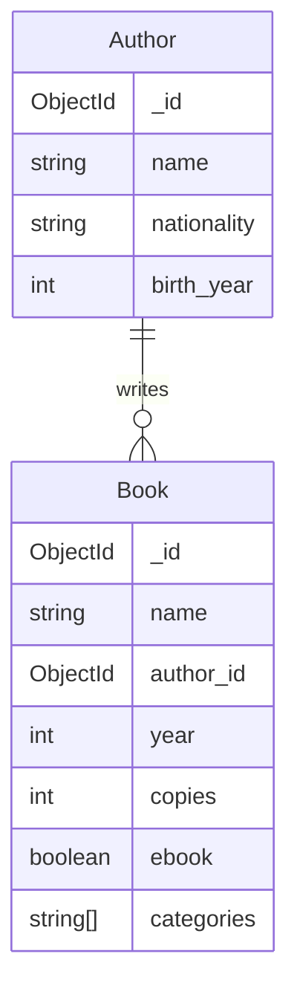

# Database operations and data model in MongoDB

In the third part of the course, we learn the basic database operations in the MongoDB database management system. We will also cover the core concepts of the MongoDB data model. During this part, you will learn how to perform CRUD and aggregation operations in the MongoDB database and how to use embedded documents and document references in the MongoDB data model. You will also design and set up a database for your project.

## CRUD operations

The [CRUD](https://en.wikipedia.org/wiki/Create,_read,_update_and_delete) operations (create, read, update, delete) are the most common database operations in any database management system. Next, let's practice their usage in MongoDB. Before starting the exercises, open the MongoDB Compass application we used during the previous part and open the `library` database in the MongoDB Shell.

> [!WARNING]  
> Make sure that the MongoDB Shell is using the `library` database by executing the `use library` command. The command input line should start with "library" (name of the used database).

> [!IMPORTANT]  
> Exercise 1 👨‍💻: Create a new Word document for the exercises in this part. Add the information mentioned in the exercises to the file for a later submission. You can include the database queries as text or as [screenshots](https://www.take-a-screenshot.org/) of the MongoDB Shell (no need to include the query result in the screenshot). Once you are done with the exercises in this part, submit the file to the "Database operations in MongoDB" Moodle submission in PDF format.

### Inserting documents

> [!WARNING]  
> While you are reading the MongoDB documentation, choose the language as "MongoDB Shell" from the "Select your language" menu.

Read the [Insert Documents](https://www.mongodb.com/docs/manual/tutorial/insert-documents/) guide. Then, insert a single document to the `books` collection with the following details using the `insertOne` method:

| title                 | author        | year | categories                          | copies | ebook |
| --------------------- | ------------- | ---- | ------------------------------- | ------ | ----- |
| "Pride and Prejudice" | "Jane Austen" | 1813 | "Romance", "Classic", "Fiction" | 3      | false |

The data should be in the following format:

- The `title` and `author` field values should be strings
- The `copies` and `year` field values should be integers
- The `categories` field value should be an [array](https://www.mongodb.com/docs/manual/tutorial/query-arrays/) of strings representing one or many categories of the book
- The `ebook` field value should be a boolean representing whether the book is an ebook version of the book or not

Then, list all documents in the `books` collection and make sure that the inserted documents have the correct information. You'll notice that each document has an automatically generated `_id` field which act as a primary key. These values are [ObjectId](https://www.mongodb.com/docs/manual/reference/method/ObjectId/) objects, such as `ObjectId("507f1f77bcf86cd799439011")`.

> [!WARNING]  
> Let MongoDB automatically generate a unique value for the `_id` field. The field will act as a primary key for the document.

Insert the following documents simultaneously using the `insertMany` method:

| title                                               | author                      | year | categories                                                   | copies | ebook |
| --------------------------------------------------- | --------------------------- | ---- | -------------------------------------------------------- | ------ | ----- |
| "War and Peace"                                     | "Leo Tolstoy"               | 1869 | "Historical Fiction", "Classic", "Philosophical Fiction" | 84     | true  |
| "The Lord of the Rings: The Fellowship of the Ring" | "John Ronald Reuel Tolkien" | 1954 | "Fantasy", "Adventure", "Epic"                           | 0      | false |
| "Brave New World"                                   | "Aldous Huxley"             | 1932 | "Dystopian", "Science Fiction", "Classic"                | 20     | true  |
| "The Hobbit"                                        | "John Ronald Reuel Tolkien" | 1930 | "Fantasy", "Adventure", "Classic"                        | 17     | false |

Then, list all the documents in the `books` collection.

> [!IMPORTANT]  
> Exercise 2 👨‍💻: Save the mentioned two queries (`insertOne` and `insertMany`) to the submission file.

### Querying documents

Read the [Query Documents](https://www.mongodb.com/docs/manual/tutorial/query-documents/) and the [Sorting documents](https://www.geeksforgeeks.org/mongodb/mongodb-sort-method/) guides. Then, familiarize yourself with the following query concepts:

- [Comparison query operators](https://www.geeksforgeeks.org/mongodb/mongodb-comparison-query-operators/) are used to _implement comparisons_, such as "greater than" or "less than" (similar as, e.g. `>` and `<` in SQL)
- [Logical query operators](https://www.geeksforgeeks.org/mongodb/mongodb-logical-query-operators/) are used to _combine conditions_, such as "condition OR other condition" (similar as, e.g. `OR` and `AND` in SQL)
- [Array field query operations](https://www.mongodb.com/docs/manual/tutorial/query-arrays/) are used to _query array fields_, such as the `categories` field in the `books` collection

Finally, implement and execute the following queries in the MongoDB Shell:

1. Find the book "To Kill a Mockingbird"
2. Find the book "To Kill a Mockingbird" using its `_id` field (use the document's `_id` field value you got from the previous query's result). 💡 Hint: note that `ObjectId("507f1f77bcf86cd799439011")` is an `ObjectId` object whereas `"507f1f77bcf86cd799439011"` is a string
3. Find the books that have more than fifteen copies. Sort the books in ascending order by the number copies
4. Find the books written by the author "Leo Tolstoy" before the year 1890. Sort the books in descending order by the publishing year
5. Find the books written by either the author "Jane Austen" or "Aldous Huxley". Sort the books in ascending order by the author's name and descending order by the publishing year
6. Find the books that are published after the year 1950 and before the year 2020
7. Find the books that have either the "Thriller" or the "Drama" genre

> [!IMPORTANT]  
> Exercise 3 👨‍💻: Save the mentioned seven queries to the submission file.

### Updating documents

Read the [Update Documents](https://www.mongodb.com/docs/manual/tutorial/update-documents/) guide. Then, implement and execute the following queries in the MongoDB Shell:

> [!NOTE]
> Choose the update operation based on the number of documents you intend to update (one or many).

1. Change the publishing year of the book "The Hobbit" to 1937 and the ebook status to true
2. Set the number of copies as zero for all books written by the author "John Ronald Reuel Tolkien"
3. Increase the number of copies of books published after the year 1920 by two, _without reading the current values_. 💡 Hint: [$inc](https://www.mongodb.com/docs/manual/reference/operator/update/inc/) operator
4. Add the genre "American literature" for all books written by the author "Colleen Hoover", _without reading the current value_. 💡 Hint: [$push](https://www.mongodb.com/docs/manual/reference/operator/update/push/#mongodb-update-up.-push) operator
5. Remove the genre "Non-fiction" from the book "Island", _without reading the current value_. 💡 Hint: [$pull](https://www.mongodb.com/docs/manual/reference/operator/update/pull/) operator

> [!IMPORTANT]  
> Exercise 4 👨‍💻: Save the mentioned five queries to the submission file.

### Deleting documents

Read the [Delete Documents](https://www.mongodb.com/docs/manual/tutorial/remove-documents/) guide. Then, implement and execute the following queries in the MongoDB Shell:

> [!NOTE]
> Choose the delete operation based on the number of documents you intend to delete (one or many). This avoids accidentally deleting too many documents.

1. Delete the book "Pride and Prejudice"
2. Delete all the books which have no copies and are ebooks

> [!IMPORTANT]  
> Exercise 5 👨‍💻: Save the mentioned two queries to the submission file.

## Aggregation operations

MongoDB supports similar aggregation operations as SQL's `GROUP BY` clause and aggregation functions such as `COUNT` and `SUM`. Read the [Aggregation in MongoDB](https://www.geeksforgeeks.org/mongodb/aggregation-in-mongodb/) guide. Then, familiarize yourself with the following aggregation concepts:

- [$count](https://www.geeksforgeeks.org/mongodb/how-to-group-by-and-count-in-mongodb/) is used for _counting documents_ (similar as `COUNT` in SQL) and [$sum](https://www.mongodb.com/docs/manual/reference/operator/aggregation/sum/) is used for _summing field values_ (similar as `SUM` in SQL)
- [$group](https://www.mongodb.com/docs/manual/reference/operator/aggregation/group/) is used for _grouping documents_ before some aggregate operator (e.g. `$sum`) is applied to each group (similar as `GROUP BY` in SQL)
- [$match](https://www.geeksforgeeks.org/mongodb/mongodb-match-operator/) is used to _filter rows_ before or after some other aggregation pipeline operation is performed

Finally, implement and execute the following aggregations in the MongoDB Shell:

1. Display the total number of books
2. Display the total number of book copies
3. Display the number of books by each author
4. Display the number of book copies by each author
5. Display the total number of book copies of books that are not ebooks and have the "Romance" category. 💡 Hint: pay attention to the order of the aggregation operations (that is, the order of the aggregation operation objects in the argument array)
6. ⭐ Bonus: Display the publishing year of each author's first and latest book. 💡 Hint: find suitable [aggregation accumulators](https://www.mongodb.com/docs/manual/reference/mql/accumulators/)

> [!IMPORTANT]  
> Exercise 6 👨‍💻: Save the mentioned five queries to the submission file.

## Data modeling – embedding data or using references

Now that we know how basic database operations are performed in MongoDB, it is time to discuss data modeling. MongoDB's data model is very flexible, and there are usually many different ways to achieve the same kind of data requirements. To understand the core concepts and how to establish relationships in the MongoDB data model, start by reading the [Embedded Data Versus References](https://www.mongodb.com/docs/manual/data-modeling/concepts/embedding-vs-references/) guide.

Let's consider the case where we would need to store more author-related information to the `books` collection, such as the author's nationality and year of birth. We would need to consider two alternative implementations:

1. Adding new fields to the `books` collection
2. Adding a new `authors` collection and referencing it from the `books` collection documents

With the first approach, we could represent the author as an object with the required information. Let's, for example, consider the following `books` document:

```json
{
  "_id": "6784c8cdd2cb986c92dbd4ab",
  "title": "The Hobbit",
  "year": 1937,
  "categories": ["Fantasy", "Classic"],
  "copies": 17,
  "ebook": true,
  "author": {
    "name": "John Ronald Reuel Tolkien",
    "birth_year": 1892,
    "nationality": "British"
  }
}
```

In this approach, the `author` field contains an _embedded document_. In our case, this approach has issues with data duplication because we would have the same author information in multiple documents (e.g., all books of the author John Ronald Reuel Tolkien), causing wasted storage space and a high risk of data inconsistency (e.g., while updating the author's information).

> [!TIP]
> Embedded documents are more suitable, for example, in cases where the embedded data isn't repeated within the collection, and updating it doesn't reflect other documents. For example, a user's home address information:
>
> ```json
> {
>   "_id": "681c99f43c05bd6eec367321",
>   "first_name": "John",
>   "last_name": "Doe",
>   "address": {    
>     "street": "111 Elm Street",    
>     "city": "Springfield",    
>     "state": "Ohio",    
>     "country": "US",    
>     "zip": "00000"    
>   }
> }
> ```

The second approach would use a _reference_ to establish the relationship. The basic idea is similar to having a foreign key referencing a primary key in a relational database schema. In our case, the benefit of this approach is avoiding data duplication. The following database diagram visualizes the database structure in the second approach:



Let's consider how we could implement the relationship between the `authors` and the `books` collection in our database using a reference. Let's assume that we have the following documents in the `authors` collection:

| \_id                                 | name                        | birth_year | nationality |
| ------------------------------------ | --------------------------- | ---------- | ----------- |
| ObjectId("6741744df83cf4ce0abb1e9c") | "Leo Tolstoy"               | 1828       | "Russian"   |
| ObjectId("507f1f77bcf86cd799439011") | "John Ronald Reuel Tolkien" | 1892       | "British"   |
| ObjectId("6741745dd39e63730ea251b7") | "Aldous Huxley"             | 1894       | "British"   |
| ObjectId("6741746bbc9c119bcafc58ee") | "Jane Austen"               | 1775       | "British"   |

Now, in the `books` collection, the `author_id` field can be an `ObjectId` object referencing the corresponding document's `_id` field in the `authors` collection. For example:

| \_id                                 | title        | author_id                            | year | categories               | copies | ebook |
| ------------------------------------ | ------------ | ------------------------------------ | ---- | -------------------- | ------ | ----- |
| ObjectId("6784c8cdd2cb986c92dbd4ab") | "The Hobbit" | ObjectId("507f1f77bcf86cd799439011") | 1937 | "Fantasy", "Classic" | 17     | true  |

Here's the same document in the JSON format:

```json
{
  "_id": "6784c8cdd2cb986c92dbd4ab",
  "title": "The Hobbit",
  "year": 1937,
  "categories": ["Fantasy", "Classic"],
  "copies": 17,
  "ebook": true,
  "author_id": "507f1f77bcf86cd799439011"
}
```

This is a very similar implementation to having a foreign key referencing a primary key in a relational database. It is worth noting, however, that _in MongoDB, there's no foreign key concept_ and because of that, no foreign key constraints.

The [MongoDB Relationships](https://dev.to/chafroudtarek/mongodb-relationshipsone-to-oneone-to-manymany-to-many-njc) article covers more examples of different kinds of relationships between collections, for example, how to implement many-to-many relationships. The article describes the reference approach, but it is always possible to use embedded documents as well. However, it is worth noting the possible drawbacks mentioned above.

> [!IMPORTANT]  
> Exercise 7 👨‍💻: Read the [Data consistency](https://www.mongodb.com/docs/manual/data-modeling/data-consistency/) documentation. Describe what kind of problems the lack of [referential integrity](https://www.ibm.com/docs/en/informix-servers/14.10?topic=integrity-referential) support causes in MongoDB, for example, in the previous example? What kind of application-level measures would be required to achieve data consistency? You can consider cases such as creating a `books` collection document and deleting an `authors` collection document in the previous example.

> [!NOTE]  
> The [$lookup](https://www.mongodb.com/docs/manual/reference/operator/aggregation/lookup/) aggregation operation is the closest thing to RDMS's joins in MongoDB. It can be used to "join" documents from other collections using a reference key (e.g., joining an `authors` collection document into a `books` collection document based on the `author_id` field).

## Designing data model for the project

Now that we know about the MongoDB data model and the basic database operations, it is time to design a small MongoDB database of our own. These are the requirements for the project's data model:

- Should consist of _at least two collections_
- At least one relationship between two collections should be implemented using an id reference (like with the `books` and `authors` collections in the example above). Otherwise, feel free to use embedded documents as well
- At least two collections should each have at least three fields (on top of the `_id` field) with more than one different data type (e.g., not only string-type fields)

Here are two examples of project ideas for inspiration:

> _"Your friend forgot to buy the snacks for the party again, and they could use a shopping list database. A shopping list has a name (e.g. "Snacks for the Halloween party"), completion status (is the shopping list completed or not), the name of the store (e.g., "Lidl"), and the name of the shopper. A shopping list contains many items that the shopper should buy from the store. Item has a name (e.g. "Chips"), a brand (e.g. "Pringles"), quantity (e.g. 2), one or more tags (e.g. "Snacks" and "Salty snacks"), and a purchased status (is the item purchased or not)."_

> _"Your teacher is tired of messy Excel sheets and needs a database to track students' grades in different courses. A course has a name, a teacher's name, credits, year, semester (e.g. "Spring") and one more topic (e.g. "MongoDB" and "NoSQL"). A course has many grades for different students. A student's grading has a student's name, student number, grade (between 0 and 5), and comment (teacher's free-form textual comment regarding the grading)."_

Come up with your own database or use the ideas above. Feel free to make any modifications. Once you have designed the database schema, create a database and the collections in MongoDB Compass. Then, insert a few documents into each collection using the MongoDB Shell.

> [!WARNING]  
> The library database used in the previous exercises isn't suitable for the project. Come up with your own project idea or use the examples above with possible modifications.

> [!IMPORTANT]  
> Exercise 8 👨‍💻: Implement an [entity relationship diagram](https://www.geeksforgeeks.org/mongodb/equivalent-of-erd-for-mongodb/) for your project's data model in the format you prefer. Include the names of the entities, their relationships, their fields, and data types. Add an image of the diagram to the submission file.

> [!WARNING]  
> Don't use whitespace (e.g., space between words) in database, collection, or field names. You can use the `_` symbol as a word separator, e.g., field name `birth_year`, _not_ `birth year`. Collection names are commonly in plural form, e.g., collection name `books`, _not_ `book`.

> [!IMPORTANT]  
> Exercise 9 👨‍💻: Create _a new database_ for your project and add the collections in the MongoDB Compass. Then, insert a few documents into each collection as test data using the MongoDB Shell. Take a screenshot of the database view in the MongoDB Compass (visible after clicking the database name on the connections list) and add it to the submission file. The screenshot should contain the database's name and the list of the database's collections. Revisit [Manage Databases in Compass](https://www.mongodb.com/docs/compass/current/databases/), [Manage Collections in Compass](https://www.mongodb.com/docs/compass/current/collections/), and [Insert Documents](https://www.mongodb.com/docs/manual/tutorial/insert-documents/) guides if you have trouble.

⏭️ [Move on to the final part](./4-mongo-python.md)
