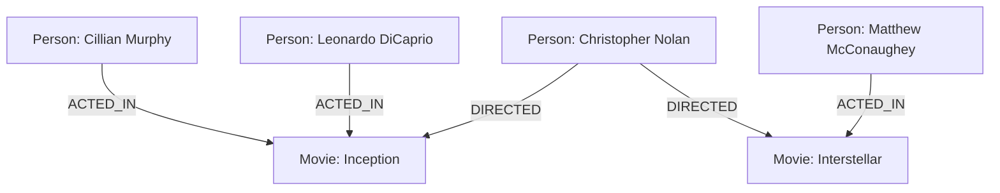

# Welcome to the Introduction to NoSQL course! 👋

You are about to dive into to the exciting world outside relational databases... 🦑

---

## About the course

- The course focuses on the diverse family of non-relational database management system, referred to commonly as **NoSQL database management systems**
- During this course, we will learn the principles of NoSQL DBMSs, how they differ from relational database management systems and what are their benefits and challenges
- We will be focusing mostly on a widely adopted NoSQL DBMS called **MongoDB**
- We will be covering MongoDB data management principles, data model, database operations and database programming in Python
- The prequisite for the course is **Data Management and Databases** and **Python Programming** courses

---

## Learning objectives

- The course has the following learning objectives:
  - Explain the main characteristics of NoSQL databases
  - Explain the main differences between NoSQL and relational databases
  - Provide examples of the main application areas of NoSQL databases
  - Explain the principles of the data model in the MongoDB database management system
  - Install the MongoDB database management system and the MongoDB Compass tool
  - Create a database in the MongoDB database management system
  - Perform database operations in the MongoDB database
  - Implement a simple Python application that operates on a MongoDB database

---

## Materials and exercises

- The course material and exercises consists of **four parts**, which should be completed in the specified order:
  - The first part is **introduction to NoSQL DBMSs** with a multiple choice Moodle exam
  - The second part is **introduction to MongoDB DBMS** with a multiple choice Moodle exam and some practical exercises related to setting up the MongoDB DBMS
  - The third part covers the **MongoDB database operations** and data model with some practical exercises related to database queries
  - The fourth part covers **database programming in Python** with a small programming project exercise
- Course work submissions are in the Moodle area, but otherwise materials and exercises are in GitHub (link in the Moodle area)

---

## Schedule and assesment

<!-- TODO -->
- The course schedule is very flexible, there are only **two deadlines**:
  - Passing the Moodle exam of the first part **before Thursday 30.10. at 23:59**
  - Finishing everything else **before Sunday 14.12. at 23:59.**
- The course assesment is either **pass or fail**. A passing grade requires passing the two Moodle exams and completing the other exercises in accordance with their requirements
- If your submission has issues, the teacher will request changes and you have a chance to resubmit your work

---

## Brief history of NoSQL databases

- In the early 2000s, as the internet expanded, major companies such as Google and Amazon began to face unprecedented challenges related to data volume, velocity, and variety
- Traditional **relational database management systems** (RDBMSs) struggled to meet these demands, particularly in terms of scalability, flexibility, and performance in distributed environments
- To address these limitations, a new class of highly scalable systems, known as **NoSQL DBMSs**, began to emerge
- Since the 2010s, the NoSQL ecosystem has grown rapidly, with many NoSQL databases establishing themselves among the most widely adopted DBMSs in the world

---

## What are NoSQL DBMSs?

> _"When people use the term "NoSQL database", they typically use it to refer to any non-relational database. Some say the term "NoSQL" stands for "non-SQL" while others say it stands for "not only SQL"."_

- The term _"NoSQL"_ is commonly referred to the large family of DBMSs that **are not relational**
- This means that the NoSQL DBMS's data model **is not based on relations and their relationships**
- Instead there are multiple different ways to structure data depending on the NoSQL DBMS, such as JSON documents, key-value pairs and graphs
- NoSQL DBMSs provide **solutions for a wide range of data requirements**. For instance, if we need extremely fast key-value operations without the overhead of managing complex relationships between data entities
- Next, let's have a look at three different NoSQL DBMSs and what's their data model approach: **MongoDB**, **Redis** and **Neo4j**

---

## MongoDB — Document database, flexible, scalable

- **MongoDB** is an example of **document-based** NoSQL DBMS
- The data is stored in **collections** which contain JSON-like **documents**:

```json
{
  "_id": "68c3b961da0f719a26014775",
  "title": "Dune",
  "author": "Frank Herbert",
  "published": 1965,
  "genres": ["Science Fiction", "Adventure", "Politics"],
  "copies": 7,
  "location": {
    "section": "Science Fiction",
    "shelf": "S2"
  }
}
```

---

## MongoDB — Document database, flexible, scalable

- Database operations are performed using the **MongoDB Query Language** (MQL), which has a very JavaScript-like syntax:

```js
db.books.find({ "author": "Frank Herbert" })
```

- The key befinits of MongoDB are its **flexibility** and **scalability**
- The JSON-like documents **don't have a fixed schema** (e.g. predefined field names and data-types), which makes it easy to evolve the structure
- MongoDB can handle large volumes of data and high traffic efficiently due **its ability to scale effortlessly** using techniques such as sharding
- These benefits make MongoDB a good choice for e.g. content management systems and real-time applications

---

## Redis — Key-value database, fast, scalable

- **Redis** is an example of **key-value** NoSQL DBMS
- The data is stored as **key-value pairs**, meaning that we can store and access any kind of string data using string keys, e.g. unique identifiers:

```shell
SET teacher:h02680 "h02680;Kalle;Ilves;kalle.ilves@haaga-helia.fi"
GET teacher:h02680
```

- The Redis data model and operations are quite limited, but the basic operations (e.g. `SET` and `GET`) are **extremely fast**
- Instead of accessing the data on disk, Redis **stores all data in main memory**
- Redis also saves snapshots of the dataset on disk, which means that the data is **persisted**
- Due to its fast key access operations, Redis is commonly used as a **cache layer** in many software systems

---

## Neo4j — Graph database, relationships, efficient queries

- **Neo4j** is an example of a **graph-based** NoSQL DBMS
- The data is stored as **nodes** wich have **relationships** with other nodes:



- Database operations are performed using the **Cypher** query language:

```
MATCH (a:Person)-[:ACTED_IN]->(m:Movie {title: "Inception"})
RETURN a.name AS Actor;
```

- Neo4j is a good choice for all use-cases where the **data can be modelled as a graph**, e.g. social networks.

---

## Why should we study NoSQL DBMSs?

> _"It is tempting, if the only tool you have is a hammer, to treat everything as if it were a nail."_

- As we saw from these examples alone, the **NoSQL DBMS family offers a wide range of different kind of tools** suitable for different kind of use-cases
- For example, Redis offers a way better performance for key-value based operations than PostgreSQL or other RDBMSs
- MongoDB on the other hand offers database schema flexibility and built-in scalability
- So, studying NoSQL DBMSs offers us more tools to solve different kind of problems

---

## The popularity of NoSQL DBMSs

- The "State of Database Survey" anually studies the usage of different database technologies. Here's a few highlights from the year 2023:
  - **MongoDB** and **Redis** NoSQL DBMSs are in the **top four most widely used DBMSs** right after PostgreSQL and MySQL
  - 74.4% percentage of respondents have used MongoDB and 73.3% have used Redis
- This indicates that **NoSQL DBMSs are widely acknowledged and used in the industry** despite not being as popular as certain relational DBMSs
- In web-development, different kind of **tech stacks containing MongoDB are widely adopted**
- MERN (MongoDB, Express, React, Node) and MEAN (MongoDB, Express, Angular, Node) are acronyms for such common tech stacks

---
layout: image-left
image: nosql-meme.jpg
---

## Closing words & QA

- Thanks for joining the session and again, welcome to the course!
- Next steps:
  1. **Let's hear any questions you have**
  2. Once everything is clear, let's start the course! 🧙‍♂️
- Don't be afraid to contact me during the course regarding any questions you have
